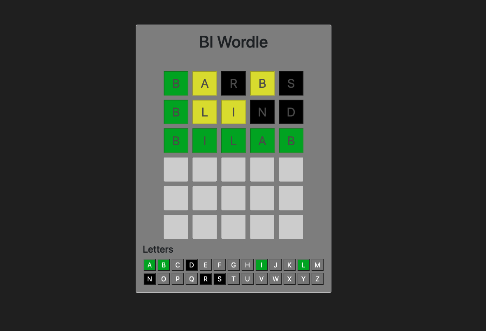

# BI-Angular lab (2022 version)
In this laboratory, we will take a closer look at the Angular Framework. Using this framework, we can create complex single page web applications (SPAs), which are commonly used in the field of business intelligence.

To pass the lab (with a result of 2: satisfactory), you must finish the guided part, for which we will detail the necessary code in the following section. Each finished individual task will contribute +1 to the final grade.

At the end of the lab, you'll have to upload the project files in a zip archive **WITHOUT the node_modules** folder!



## 1. Guided task: Creating the project
In this part we will be creating a new Angular project and review the major concepts and generated files.
### 1.1. Installing the tool and generating the project
If not already installed, install the Angular command line tool, by running the following command:
```
npm install -g @angular/cli@latest
```

Create the project by running the command line tool (CLI) with the following command:
```
ng new wordle
```
When asked by the interactive wizard select **yes** for adding the routing and **SCSS** as the style sheet format.

Open the newly generated project in your preferred IDE (e.g. VSCode or WebStorm).

### 1.2. Overview of the generated code
Lets take a closer look at the generated code! Here are some of the more important files and folders created just now.

| Filename | Description |
|----------|-------------|
|.browserlistrc | Describes the list of supported browsers. |
| angular.json | Contains the configuration of the CLI, build and test configs. |
| package.json | Lists the dependencies of the project and also contains the different run goals. |
| package-lock.json | Contains the exact version of the dependencies installed in the node_modules folder. |
| tsconfig.json | Configurations for the TypeScript compiler. |
| src/assets | Used to store static assets for the project (e.g. images). |
| src/environments | Used to store different environment configurations (e.g. development, production). |
| src/index.html | This is the HTML which will be first loaded when a user visits the page. |
| src/main.ts | The entry point of the application. |
| src/polyfills.ts | Scripts required for cross browser support. |
| src/styles.scss | The global stylesheet. |
| src/app/app.module.ts | The root module, more on that later!|
| src/app/app-routing.module.ts | Contains the setting for the routing of the root module. |

### 1.3. Angular basics: modules and components
**Module:** A module is a container for codes related to the same "thing" (same functionality, domain). A module can contain components, service providers, and all kinds of different codes, which can also be exported to be available outside the module. Each Angular application must have at least one module, called the root module.

**Directive:** A directive is a class that pairs some functionality to HTML elements. There are several kinds of directives:
- Component: The most common type of directive, a component is a directive consisting of a HTML template defining an appearance and a TypeScript class defining a behavior.
- Attribute directive: Renders function to a HTML attribute, for example by changing the behavior/appearance of the element. There are several built-in attribute directives, such as Ngclass, NgStyle, NgModel
- Structural directive: Modifies the structure of the DOM by adding or deleting HTML elements. Some built-in structural directives are: NgIf, NgFor, NgSwitch

## 2. Guided task: The home page
In this task, we will create a small introduction page for our game.

### 2.1. Install and enable bootstrap
Install bootstrap, which we will be using to help us with styling the application. Run the following command in the project root folder:
```
npm i bootstrap
```

Open **src/styles.scss** and add the following to enable bootstrap for our application, and give some styling to iy:
```
@import "~bootstrap/scss/bootstrap";

@media (min-width: 510px) {
  .container{
      max-width: 500px;
  }
}

```

Add the following two classes to the **src/app/app.component.scss**:
```
.app-bg {
  background: #222;
}

.card-bg {
  background: #888;
}
```

Replace the content of the **app.component.html** file with this:
```
<div class="app-bg d-flex flex-column justify-content-center vh-100">
  <div class="container">
    <div class="card overflow-hidden">
      <div class="card-body card-bg">
        <h1 class="text-center mb-5">BI Wordle</h1>
        <router-outlet></router-outlet>
      </div>
    </div>
  </div>
</div>

```

This will be the "frame" of our applications UI. Notice the \<router-outlet\> directive, which serves as the insertion point of our pages.

### 2.2. Create the home page component
To generate a new component, called home-page, run the following command:

```
ng g c pages/home-page --skip-selector
```

*Note: In the Angular terminology we usually differentiate three types of components:
- **dumb/pure components:** their state depends entirely on ther inputs, therefore they are the most low-level and reusable of the three.
- **smart components:** smart components are usually more "wired together" with the application, they depend on services, inject dependencies, etc. They usually contain dumb components and are not really reusable themselves.
- **page components:** page components are smart components which are loaded through routing, therefore they don't need HTML selectors, as they aren't instantiated from HTML, but based on the route.

The home page component is of the former, a page component. That's why we used the `--skip-selector` flag and why we have to add it to the routing.

Update the routing config, by setting our new home-page as the default page in the **app-routing.module.ts**. Don't forget to import the component!

```
const routes: Routes = [
  {
    path: '',
    pathMatch: 'full',
    redirectTo: 'home'
  },
  {
    path: 'home',
    component: HomePageComponent
  }
];
```

Replace the home-page.component.html with the following code:

```
<p class="fw-bold">Welcome to BI-Wordle!</p>
<p>In this game you will have to guess a 5 letter long word! After each guess, you will see whether the chosen letter:</p>
<ul>
  <li>is not in the word (gray)</li>
  <li>exists in the world (yellow)</li>
  <li>is in the word an in the correct place (green)</li>
</ul>
<button class="btn btn-primary w-100" [routerLink]="['/game']">Start Game!</button>
```

This is a short description of the game, and a button, which will lead us to the game screen, using the routerLink directive.

*Note: notice the [ ] for propery binding.*

## 3. Guided task: Implementing the game logic
In the next part, we will implement the gamelogic itself.

### 3.1. Models
Create a folder under the app folder named model! Under this folder, we will create two files, the first is:

**app/model/guess-result.ts**:
```
export enum GuessResult {
  NOT_TRIED,
  NO_MATCH,
  WRONG_POSITION,
  GOOD_POSITION
}
```
This enum contains the possible matches of a character in a guess.

**app/model/guess.ts**:
```
import { GuessResult } from "./guess-result";

export interface Guess {
  word: string;
  matches: GuessResult[];
}

export const ALPHABET: string[] = ["A","B","C","D","E","F","G","H","I","J","K","L","M","N","O","P","Q","R","S","T","U","V","W","X","Y","Z"];
export const MAX_NUMBER_OF_GUESSES = 6;

```
This interface describes how a guess object looks like, some usefull constants are also defined in this file.

### 3.2. Game service
Let's create the game service! Run the following command:
```
ng g s services/game
```

Replace the contents of the newly generated game.service.ts with the follwing:

```
import { HttpClient } from '@angular/common/http';
import { Injectable } from '@angular/core';
import { MAX_NUMBER_OF_GUESSES } from '../model/guess';
import { GuessResult } from '../model/guess-result';
import { tap } from 'rxjs';

@Injectable({
  providedIn: 'root'
})
export class GameService {

  private word: string = '';
  private wordList: Array<string> = [];
  private guesses: Array<string> = [];

  constructor(private http: HttpClient) {}

  initWordList() {
    // We load the words from a static file
    return this.http.get<string[]>('assets/json/word-list.json').pipe(
      tap(result => {
        this.wordList = result;
      })
    );
  }

  /**
   * Starts the game by selecting a random word from the list.
   */
  startGame() {
    this.word = this.wordList[Math.round(Math.random() * this.wordList.length)];
    console.log('Game starting, the word is ' + this.word);
  }

  /**
   * Checks whether the given list is in the word list.
   * @param guessedWord
   * @returns
   */
  isInWordList(guessedWord: string): Boolean {
    return this.wordList.indexOf(guessedWord.toLowerCase()) != -1
  }

  /**
   * Evaluates a guess.
   * @param guessedWord
   * @returns
   */
  guess(guessedWord: string): GuessResult[] {
    guessedWord = guessedWord.toLowerCase();
    this.guesses.push(guessedWord);
    return this.calculateMatches(guessedWord);
  }

  /**
   * Returns whether the game is finished yet.
   * @returns
   */
  isFinished(): boolean {
    return (this.guesses.length != 0 && this.guesses[this.guesses.length - 1] == this.word)
      || this.guesses.length >= MAX_NUMBER_OF_GUESSES;
  }

  /**
   * Calculates the guess result for each character in the given word.
   * @param word
   * @returns
   */
  calculateMatches(word: string): GuessResult[] {
    let matches = Array<GuessResult>();
    for (let i = 0; i < 5; i++) {
      let char = word.charAt(i);
      if (this.word.charAt(i) == char) {
        matches.push(GuessResult.GOOD_POSITION);
      } else if (this.word.indexOf(char) != -1) {
        matches.push(GuessResult.WRONG_POSITION);
      } else {
        matches.push(GuessResult.NO_MATCH);
      }
    }
    return matches;
  }

  /**
   * Returns whether the given character was guessed in any position.
   * @param char
   * @returns
   */
  charResult(char: string): GuessResult {
    let result = GuessResult.NOT_TRIED;

    for (let guess of this.guesses) {
      let guessResult = this.calculateMatches(guess);

      // Go over the characters of each word
      for (let i = 0; i < 5; i++) {
        // If the guessed char is the current char
        if (char.toLowerCase() == guess[i]) {
          if (result == GuessResult.NOT_TRIED) {
            // If it was tried at least once, we can be sure that the result would be at least NO MATCH (possibly better)
            result = GuessResult.NO_MATCH;
          }

          if (guessResult[i] == GuessResult.GOOD_POSITION) {
            // If we find a GOOD POSITION, we can disregard each other finds and return that as our result.
            return GuessResult.GOOD_POSITION;
          } else if (guessResult[i] == GuessResult.WRONG_POSITION) {
            // Else, if we find a WRONG POSITION, we save it as the "next best result" but we keep searching
            result = GuessResult.WRONG_POSITION;
          }
        }
      }
    }
    return result;
  }
}
```
This implements the core game logic, let's study the main parts of it!

In the constructor, we inject the `HttpClient`, which is a service used to make HTTP request. To make it available for our service, we must provide first! Add the following to the **app.module.ts**, at the appropriate places!

```
import { HttpClientModule } from '@angular/common/http';

...

imports: [
  ...
  HttpClientModule
]
```

In the `initWordList()` function, we will use the `HttpClient` to download the list of possible words. This **word-list.json** is available in the current repository. [Download](assets/word-list.json) it and place it under the **assets/json** directory.

Lets examine the remaining functions! Each of their comments will describe what they do.

## 4. Guided task: Game UI
In this part, we will create the game page and associated components, which will be used as the main UI for playing the game.

### 4.1. Create the match color pipe
The `GuessResult` enum describes the possible outcomes of a guess. A letter can be either `NOT_TRIED`, `NO_MATCH`, `WRONG_POSITION` or `GOOD_POSITION`. However to indicate it to the user, we must display different colors. To overcome this issue, we will use a pipe. A pipe is an Angular component used to transform data for display purposes. Pipes are very useful for formatting data, as omplex transformation logic can be implemented in them, they are used for date formatting, localization, etc. To create a new one, run the following command:

```
ng g p pipes/match-color
```

Replace the content of the newly generated pipe (**match-color.pipe.ts**), with the following:

```
import { Pipe, PipeTransform } from '@angular/core';
import { GuessResult } from '../model/guess-result';

@Pipe({
  name: 'matchColor'
})
export class MatchColorPipe implements PipeTransform {

  /**
   * Transforms the value of a GuessReuslt to a color (green, yellow, gray or black)
   * @param value
   * @param args
   * @returns
   */
  transform(value: GuessResult): string {
    switch (value) {
      case GuessResult.GOOD_POSITION:
        return "#00AA00";
      case GuessResult.NOT_TRIED:
        return "#808080";
      case GuessResult.WRONG_POSITION:
        return "#DDDD00";
      case GuessResult.NO_MATCH:
        return "#000000";
    }
  }
}
```

### 4.2. Create the letter component
The letter component will be out first real reusable, dumb component. Its purpose is to disaply a single letter of a guess. Create it with the following command:

```
ng g c components/letter 
```

Replace the content of the **letter.component.ts** with the following:
```
import { Component, Input, OnInit } from '@angular/core';
import { GuessResult } from 'src/app/model/guess-result';

@Component({
  selector: 'app-letter',
  templateUrl: './letter.component.html',
  styleUrls: ['./letter.component.scss']
})
export class LetterComponent implements OnInit {

  @Input() letter: string = '';
  @Input() result: GuessResult = GuessResult.NOT_TRIED;

  constructor() {}

  ngOnInit(): void {}
}
```
Notice the two fields annotated with the `@Input` decorator. `@Input` and `@Output` are used to facilitate the transfer of data between parent and child components. In this case, it means that the fields `letter` and `result` can be given a value by the parent component.

Replace the contents of the **letter.component.html** with the following:
```
<input type="text" class="letter" maxlength="1" [value]="letter" [ngStyle]="{'background-color': result | matchColor}" disabled>
```
In this HTML template code, we bind the value attribute to the value field, using property binding. We also bind the style attribute, using the previously created pipe to the value of the result.

Lets add some styling to our component, insert the following into the **letter.component.scss**:

```
.letter {
  width: 60px;
  height: 60px;
  margin-left: 5px;
  margin-right: 5px;
  text-align: center;
  font-size: 30px;
}
```

### 4.3. Create the guess component
The guess component will be used to represent a guess. A guess is made up of 5 letters, so here, we will re-use the previously created letter component.

Generate the guess component by running:
```
ng g c components/guess
```

Replace the contents of the **guess.component.ts** with the following:
```
import { Component, Input, OnInit } from '@angular/core';
import { Guess } from 'src/app/model/guess';

@Component({
  selector: 'app-guess',
  templateUrl: './guess.component.html',
  styleUrls: ['./guess.component.scss']
})
export class GuessComponent implements OnInit {

  @Input() guess: Guess = {
    word: '',
    matches: [],
  };

  constructor() {}

  ngOnInit(): void {

  }
}
```

Replace the contents of th **guess.component.html** with the following:
```
<div class="guess-row">
  <app-letter *ngFor="let index of [0, 1, 2, 3, 4]" [letter]="guess.word[index] || ''" [result]="guess.matches[index]"></app-letter>
</div>
```

Finally add some styling to the component by inserting the following into **guess.component.scss**

```
.guess-row {
  margin-top: 10px;
  margin-bottom: 10px;
}
```

### 4.4. Create the keyboard component
Our final component will be the keyboard component, used to display which letters were used to the user. For this, first generate a new component by running the following command:
```
 ng g c components/keyboard
```

Replace the contents of the **keyboard.component.ts** with the following:
```
import { Component, OnInit } from '@angular/core';
import { ALPHABET } from 'src/app/model/guess';
import { GuessResult } from 'src/app/model/guess-result';
import { GameService } from 'src/app/services/game.service';

@Component({
  selector: 'app-keyboard',
  templateUrl: './keyboard.component.html',
  styleUrls: ['./keyboard.component.scss']
})
export class KeyboardComponent implements OnInit {

  alphabet: string[] = ALPHABET;

  constructor(private gameService: GameService) {}

  ngOnInit(): void {}

  charResult(char: string): GuessResult {
    return this.gameService.charResult(char);
  }
}
```

Replace the contents of th **keyboard.component.html** with the following:

```
<h4>Letters</h4>
<button class="keyboard-letter" type="button" *ngFor="let key of alphabet" [ngStyle]="{ 'background-color': charResult(key) | matchColor }">{{key}}</button>
```

Finally add some styling to the component by inserting the following into **keyboard.component.scss**
```
.keyboard-letter {
  width: 30px;
  margin: 2px;
  color: white;
}
```

### 4.5. Generate the game page component
The final component which will use all the building blocks we created so far will be the game page component. Generate this new component using the following command:

```
ng g c pages/game-page --skip-selector
```

Set up routing for the new page, just like the previous time, add the following to the **app-routing.module.ts**:

```
...
  {
    path: 'game',
    component: GamePageComponent
  }
```

Don't forget to import the component!

Replace the content of the **game-page.component.ts** with the following:

```
import { Component, HostListener, OnInit } from '@angular/core';
import { ALPHABET, Guess, MAX_NUMBER_OF_GUESSES } from 'src/app/model/guess';
import { GameService } from 'src/app/services/game.service';

@Component({
  templateUrl: './game-page.component.html',
  styleUrls: ['./game-page.component.scss']
})
export class GamePageComponent implements OnInit {

  currentGuessNumber: number = 0;
  guesses: Guess[] = [];

  constructor(private gameService: GameService) {}

  ngOnInit(): void {
    // Fill the guesses array with empty guesses
    for (let i = 0; i < MAX_NUMBER_OF_GUESSES; i++) {
      this.guesses.push({
        word: '',
        matches: [],
      });
    }
    this.gameService.initWordList().subscribe(() => {
      this.gameService.startGame();
    });
  }

  @HostListener('document:keyup', ['$event'])
  handleKeyboardEvent(event: KeyboardEvent) {
    if (this.gameService.isFinished()) {
      return;
    }

    const currentWord = this.guesses[this.currentGuessNumber].word;
    const key = event.key;

    if (key == 'Enter' && currentWord.length == 5) {
      if (this.gameService.isInWordList(currentWord)) {
        this.guesses[this.currentGuessNumber].matches = this.gameService.guess(currentWord);
        this.currentGuessNumber++;
      } else {
        alert("Not in the word list!")
      }
    } else if (key == 'Backspace') {
      this.guesses[this.currentGuessNumber].word = currentWord.substring(0, currentWord.length - 1);
    } else if (ALPHABET.indexOf(key.toUpperCase()) != -1 && currentWord.length < 5) {
      this.guesses[this.currentGuessNumber].word += key.toUpperCase();
    }
  }
}
```

Replace the contents of the **game-page.component.html** with the following:

```
<div *ngFor="let guess of guesses" class="text-center">
  <app-guess [guess]="guess"></app-guess>
</div>
<app-keyboard></app-keyboard>
```

Thats it, start the application by running the following command in the base directory!
```
npm start
```

After finisihing the initial startup, the application will be available on `http://localhost:4200`

## 5. Individual task: End game page component
- Create and end game page available on the "/end" route.
- The page should contain a "Game over" label.
- When the game finished navigate to this page automatically.

**Hints:**
- To navigate from a component code, you can inject the Router to the game-page component (by making it a constructor parameter) and than use the navigateByUrl method when the game is finished.

## 6. Individual task: End game page dynamic content 
- Extend the previously created end game page, to either say "Congratulations!" or "Better luck next time!" based on the result of the game.
- Create a new game button, which will be used to start a new game.

**Hints:**
- The game result can be determined by the game-service, i.e. if the last guess is equals to the selected word, we can be sure that the player won. The game service can be injected to the new game result page component.
- To conditionally display text, you can use the `NgIf` structural directive on parts of the HTML. Alternatively you can store the message in a variable and dispaly it using the interpolation operator (`{{ }}`).

## 7. Individual task: End game statistics
- When playing multiple games, save the statistics on how many gueses each game took to finish. E.g. 1 guess: 0 game, 2 guess: 1 game, 3 guess: 5 games...
- Display this statistic on the end game page in a table where the rows are the number of tries. E.g.
- A game is considered lost, if after 6 tries the selected word is not found

| Number of tries | Games |
| --- | --- |
| 1 | 0 |
| 2 | 1 |
| 3 | 5 |
| 4 | 2 |
| 5 | 1 |
| 6 | 0 |
| lost | 0 |


**Hints:**
- The game service should also store the results. It's not a problem however if they are lost on a page reload, you can use simple class variables.
- You can use static HTML to build the table (you don't have to prepare for variable amount of rows).

